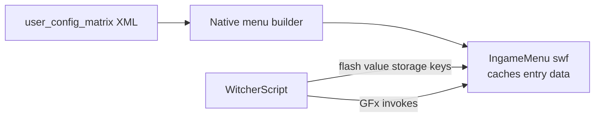

# Flash menus: constraints

Findings from dynamic slider notch impl.

## Architecture

## Notes

1. Options panel entries are built natively from the config XML. `CR4IngameMenu.showOptionsPanel` and `IngameMenu_FillOptionsSubMenuData` appear to be dead code (inserting logging into the base game scripts yields nothing).
2. `SetFlashArray("options.update_disabled", ...)` triggers a rebuild fromthe native data. Any script-replaced slider list (`options.remove_entry` +`options.insert_entry`) is wiped back to the XML placeholders.
3. Running `remove_entry`/`insert_entry` against a live panel corrupts the widget (slider sticks to the mouse cursor, seems like pointer down/up corruption).
4. Keyboard/gamepad appear to work without issue.
5. `m_fxUpdateOptionLabel` and `m_fxRemoveOption` target main menu entries, not option rows (vanilla uses: `toggle_render` caption,`Continue`/`LoadGame` removal).
6. Direct GFx invokes did not appear to trigger the native rebuild. They may be a safe channel if a row-targetedinvoke is found in the swf.
